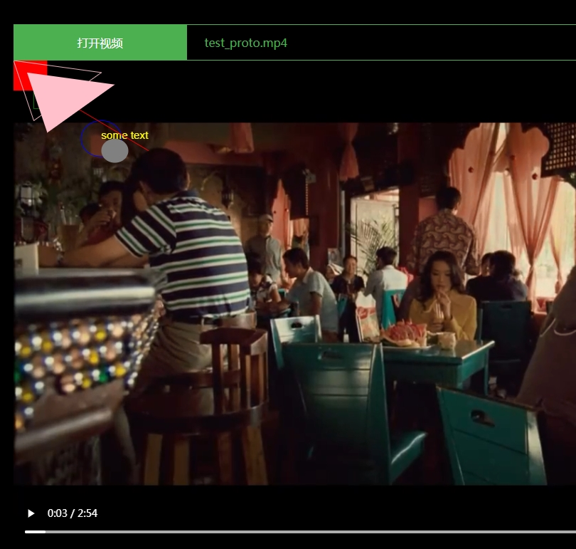

# Video Annotation File

A simple video annotation file format definition.  The content described in this file will be rendered by the player.



# Structure

```
{
"version": "1.0",
"frameList":[
  {CONTENT}
]
}
```

## CONTENT

```
{
"timeStart": xxx.xxx (in seconds),
"timeStop" : xxx.xxx (in seconds),
"style"    : {STYLE}
"objectList":[
	{OBJECT}
]
}
```

### OBJECT
#### Shape
| shape     | params                    | NOTE |
| --------- | ------------------------- | ---- |
| line      | x1, y1, x2, y2            |      |
| circle    | x,y, radius               |      |
| rectangle | x, y, w, h                |      |
| polygon   | points:[{"x":0, "y":0}, ] |      |
| text      | text, x, y                |      |

```
"shape":"rectangle",
"params":{"x":0, "y":0, "w":100, "h":100 },
```


#### Style

| name   | value                      | eg              |
| ------ | -------------------------- | --------------- |
| stroke | -1, fill; else stoke width | 3               |
| dash   | [x1, x2, x3]               | [5,15,10]       |
| color  | color text or value        | 'red', 0xFF1289 |
| font   | "bold 18pt Arial"          |                 |

```
"style":{
"stroke": -1,
"color": "red"
}
```


## Example

```
{
    "version": "1.0",
    "frameList": [
        {
            "timeStart": 0,
            "timeStop": 5,
            "objectList": [
                {
                    "shape": "rectangle",
                    "params": {
                        "x": 0,
                        "y": 0,
                        "w": 50,
                        "h": 50
                    },
                    "style": {
                        "stroke": -1,
                        "color": "red"
                    }
                },
                {
                    "shape": "rectangle",
                    "params": {
                        "x": 30,
                        "y": 30,
                        "w": 50,
                        "h": 50
                    },
                    "style": {
                        "stroke": 1,
                        "color": "green"
                    }
                },
                {
                    "shape": "text",
                    "params": {
                        "text": "some text",
                        "x": 130,
                        "y": 130
                    },
                    "style": {
                        "font": "12pt Arial",
                        "color": "yellow"
                    }
                },
                {
                    "shape": "circle",
                    "params": {
                        "x": 130,
                        "y": 130,
                        "radius": 30
                    },
                    "style": {
                        "stroke": 1,
                        "color": "blue"
                    }
                },
                {
                    "shape": "circle",
                    "params": {
                        "x": 150,
                        "y": 150,
                        "radius": 20
                    },
                    "style": {
                        "stroke": -1,
                        "color": "gray"
                    }
                },
                {
                    "shape": "line",
                    "params": {
                        "x1": 50,
                        "y1": 50,
                        "x2": 200,
                        "y2": 150
                    },
                    "style": {
                        "stroke": 1,
                        "color": "red"
                    }
                },
                {
                    "shape": "polygon",
                    "params": {
                        "points":[{"x":0, "y":0}, {"x":30, "y":100}, {"x":130, "y":20}]
                    },
                    "style": {
                        "stroke": 1,
                        "color": "pink"
                    }
                },
                {
                    "shape": "polygon",
                    "params": {
                        "points":[{"x":20, "y":20}, {"x":50, "y":120}, {"x":150, "y":40}]
                    },
                    "style": {
                        "stroke": -1,
                        "color": "8888"
                    }
                }
            ]
        },
        {
            "timeStart": 6,
            "timeStop": 12,
            "objectList": [
                {
                    "shape": "rectangle",
                    "params": {
                        "x": 30,
                        "y": 30,
                        "w": 50,
                        "h": 50
                    },
                    "style": {
                        "stroke": 1,
                        "color": "green"
                    }
                },
                {
                    "shape": "text",
                    "params": {
                        "text": "some text",
                        "x": 130,
                        "y": 130
                    },
                    "style": {
                        "font": "12pt Arial",
                        "color": "yellow"
                    }
                },
                {
                    "shape": "circle",
                    "params": {
                        "x": 130,
                        "y": 130,
                        "radius": 30
                    },
                    "style": {
                        "stroke": 1,
                        "color": "blue"
                    }
                },
                {
                    "shape": "circle",
                    "params": {
                        "x": 150,
                        "y": 150,
                        "radius": 20
                    },
                    "style": {
                        "stroke": -1,
                        "color": "gray"
                    }
                },
                {
                    "shape": "line",
                    "params": {
                        "x1": 50,
                        "y1": 50,
                        "x2": 200,
                        "y2": 150
                    },
                    "style": {
                        "stroke": 1,
                        "color": "red"
                    }
                },
                {
                    "shape": "polygon",
                    "params": {
                        "points":[{"x":0, "y":0}, {"x":30, "y":100}, {"x":130, "y":20}]
                    },
                    "style": {
                        "stroke": 1,
                        "color": "pink"
                    }
                },
                {
                    "shape": "polygon",
                    "params": {
                        "points":[{"x":20, "y":20}, {"x":50, "y":120}, {"x":150, "y":40}]
                    },
                    "style": {
                        "stroke": -1,
                        "color": "8888"
                    }
                }
            ]
        }
    ]
}
```

